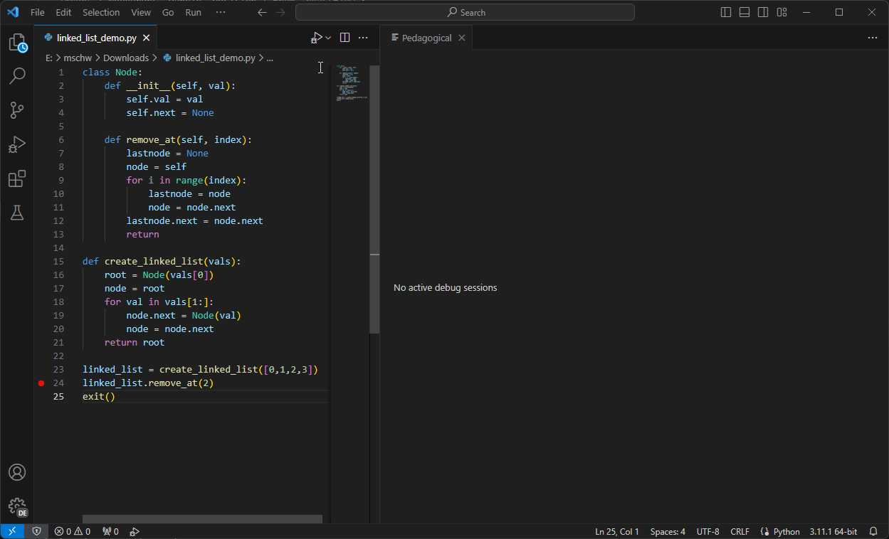

# Pedagogical VSCode

A [Python Tutor](https://pythontutor.com/)-inspired Visual Studio Code extension that displays a real-time visualization of your program's debug state.



# Installation

Install this extension through the VSCode Marketplace or by downloading the VSIX package from the Releases page.

# Usage

_Note: this extension is still in its early stages, and some visualizations may be buggy or innacurate! Improved support for more languages will be added as development continues._

To open Pedagogical, start debugging a program, then click the Pedagogical button near the bottom-left of the window. You can also open the command window (`F1` or `Ctrl+Shift+P`) and select `Show Pedagogical View`.

Simply step through your program to see the visualization update in real-time. If you have multiple debug sessions running at once, Pedagogical will use the currently active session.

Right now, Pedagogical only officially supports Python programs. You can try using Pedagogical with any other language, but expect the visualization to be buggy or innacurate. Improved support for more languages will be added as development continues.

# Development

## Setup

After cloning this repo and opening in VS Code, use `yarn` to intall packages:

```sh
yarn install
```

## Workspaces

This project is a monorepo with three workspaces under the `packages` folder:

- `extension` is the entrypoint for the VS Code extension
- `webview-ui` is the React app used in the extension's WebViewPanel
- `shared` contains shared type definitions for messages sent between the React app and the WebViewPanel

## Debugging

Run the `Run Extension` launch config (F5 by default) to start debugging the extension. This starts the `watch` scripts for `extension` and `webview-ui`, then starts a new VS Code instance with the extension loaded and the `sampleWorkspace` folder opened. This also gives the VS Code window a red titlebar and sidebar to make it stand out.

The `watch` scripts are very fast. If you leave them running in the background, you can start debugging at any time without waiting for builds to finish.

### Debugging `extension`

Breakpoints in `extension` will work just like any other app.

### Debugging `webview-ui`

Breakpoints in `webview-ui` will not be recognized if they are set through VS Code. Instead, you need to open developer tools in the launched VS Code instance and debug from there:

- In VS Code with the extension loaded, press `Ctrl+Shift+I` (or `Ctrl+Shift+P` and search `Toggle Developer Tools`)
- Click the `Sources` tab, then the `Filesystem` tab
- Click `Add folder to workspace` and select the `packages/webview-ui/src` path in the repo
- Set your breakpoints as desired.

The webview is not loaded until it needs to, so the first breakpoint you set might not work until after it's loaded for the first time. Debugging should work fine after that. If you edited a file and it didn't update in the developer tools, just close and re-open it.

### Using Redux Devtools

Redux Devtools is a very useful tool when debugging Redux stores. The store in `webview-ui` is configured to connect to a devtools server if the extension is in development mode. Run this command (either before or after starting the extension) to start Redux Devtools:

```sh
yarn redux-devtools
```

This starts the devtools server on `ws://localhost:8000` and launches a standalone devtools app. You can also use a different devtools app if you prefer.

If the webview is open and you don't see the instance in devtools, wait a few seconds then reload devtools with `Ctrl+R`, or go to settings and disconnect/reconnect.

## Adding debugger support

Becuase debuggers are implemented differently for each language, support needs to be added for each debugger to guarantee accurate information in Pedagogical. If you are a developer who would like to add support for a specific language or debugger, read the guide [Adding Debugger Support to Pedagogical](docs/adding-debugger-support.md).
