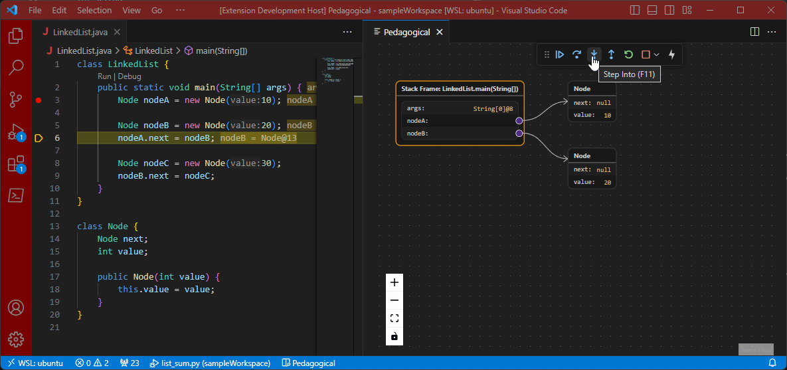
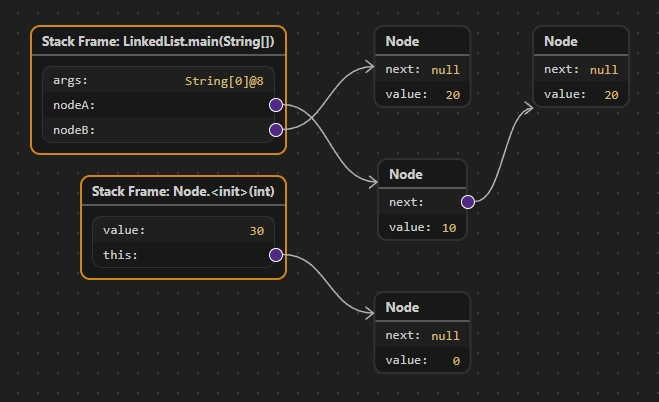
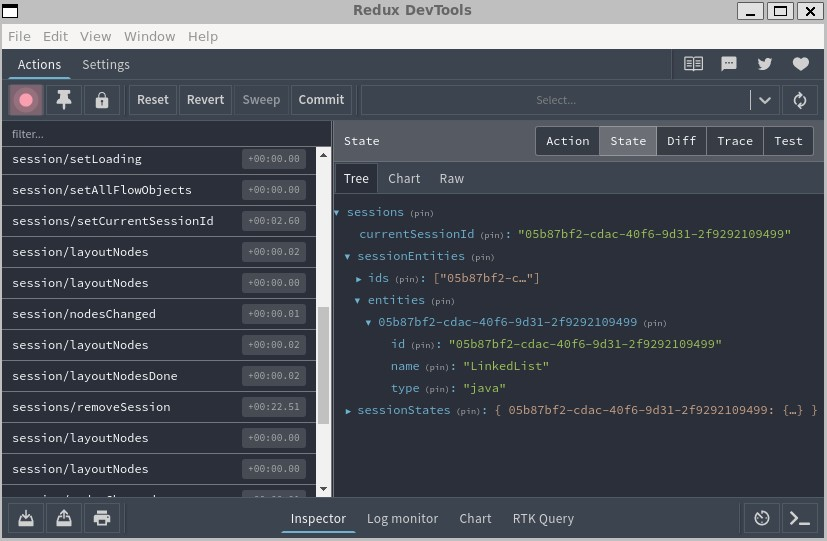
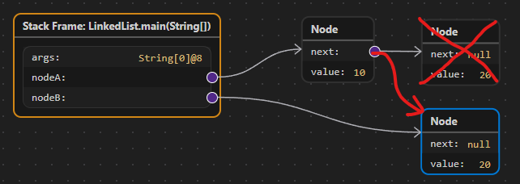
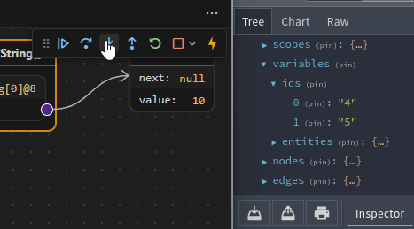
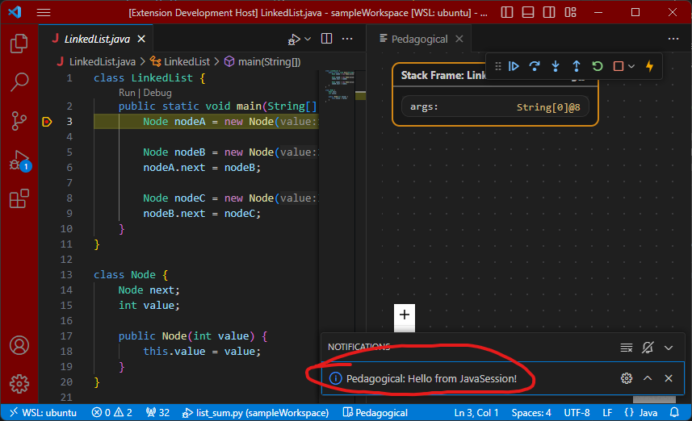
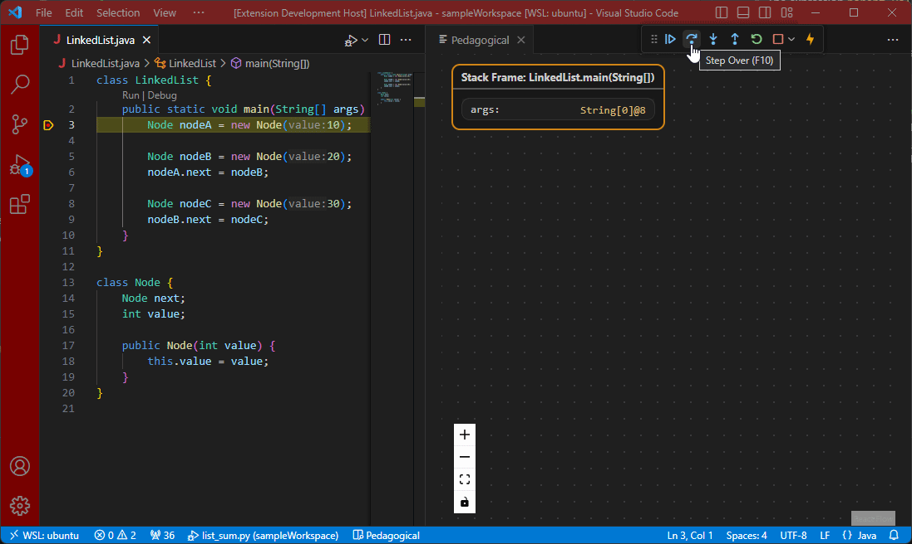
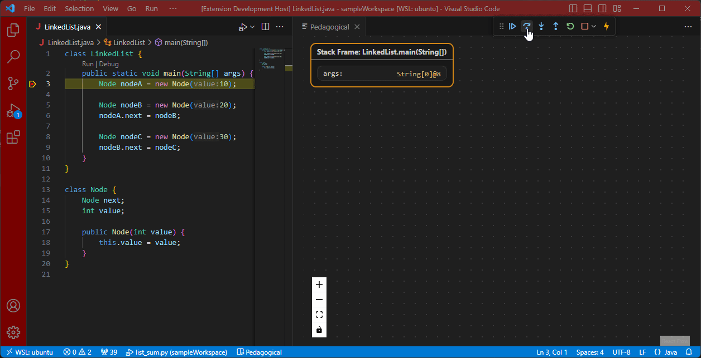

# Adding Debugger Support to Pedagogical

> NOTE: Pedagogical is in early development and some of this information is subject to change, but the general structure of debug sessions should stay the same.

The debug adapter provides a common interface debug different languages in vscode. However, this does not mean that all debug adapters function the exact same way or provide the same information (see [Debug Adapter Protocol](./debug-adapter-protocol.md)). Because of this, a debug adapter session must be implemented in Pedagogical for it to work correctly.

See [Pedagogical Sessions](./pedagogical-sessions.md) for info on how Pedagogical handles debug sessions. Basically, a debug adapter type should implement the `DefaultSession` class (for small changes to the default way that Pedagogical handles debug session), or the `BaseSession` class (if for some reason you want to support something completely different from a standard debug adapter).

In this document, we will try adding support for debugging Java files using [Microsoft's Debugger for Java extension](https://marketplace.visualstudio.com/items?itemName=vscjava.vscode-java-debug).

> I know this guide looks like a wall of text, but if you plan on adding/updating debugger support to this extension, I recommend you follow this from start to finish! You can start by removing the existing Java support. To do that:
>
> 1. Navigate to `packages/webview-ui/src/features/sessions/debugSessions`
> 2. Delete the `java` folder
> 3. Modify the `sessionClassByDebugType` object in `index.ts`:
>
> ```ts
> const sessionClassByDebugType: Record<string, BaseSessionCtor> = {
>   default: DefaultSession,
>   python: PythonSession,
>   //java: JavaSession, // <-- delete this line!
> };
> ```
>
> (Of course, please don't commit these changes to the main branch!)

## Prerequisite knowledge

I recommend you read the pages [Debug Adapter Protocol](debug-adapter-protocol.md) and [Debug Sessions in Pedagogical](pedagogical-sessions.md) so you understand how Pedagogical handles different types of debuggers.

You should know some decent JavaScript or TypeScript. This is a TypeScript project, but this guide doesn't utilize much of TypeScript's features.

You probably need to know [Redux](https://redux.js.org/introduction/getting-started) before you start writing your own code. 

## Step 1: Testing with `DefaultSession`

If Pedagogical is not configured to support a certain debug adapter, it will fall back to using the `DefaultSession`. Since our session type will most likely be based on `DefaultSession`, let's test it out to see how well it works.

First, let's run `yarn redux-devtools` so we can see all the debug objects in the Redux state, then let's run the extension.

I'm going to debug this Java file that demonstrates a basic implementation of a linked list:

```java
// LinkedList.java
class LinkedList {
    public static void main(String[] args) {
        Node nodeA = new Node(10);

        Node nodeB = new Node(20);
        nodeA.next = nodeB;

        Node nodeC = new Node(30);
        nodeB.next = nodeC;
    }
}

class Node {
    Node next;
    int value;

    public Node(int value) {
        this.value = value;
    }
}
```

Here's what Pedagogical looks like while debugging this file:



That's not too far off what we're looking for! There are a few things to note here:

- `nodeA.next` is supposed to point the `nodeB` object. Instead, it's pointing to a new object.
- After each step, all nodes slide in from the top-left. This is because each node is being recreated for each step, rather than reusing nodes from the previous step.
- The value of the `args` string array ends in `@8`. I wonder what that's for? *(foreshadowing...)*

> The ordering of the nodes is also weird, but that's partially because layouting in Pedagogical is still a work-in-progress, so let's not worry about that right now.

## Step 2: Analyzing the session state

Pedagogical stores the debug adapter objects in the Redux state. Let's view it in Redux Devtools to see if we can understand what's going on. If the devtools window looks empty, press Ctrl+R to refresh it. Make sure you have the State tab selected near the top-right. After expanding some slices in the tree, it should look something like this:


This is subject to change, but right now the `id`, `name` and `type` of each session is stored under `sessionEntities`, and each debug session's state (including all the debug objects) is stored in `sessionStates`.

Here's what our session entity looks like:

```js
"357673b0-003f-4dda-b21a-5931298b3c04": {
  id: "357673b0-003f-4dda-b21a-5931298b3c04",
  name: "LinkedList",
  type: "java",
}
```

Pretty straightforward. The `id` corresponds to the debug session's id given by vscode. We can see the debug adapter type is simply `"java"`, which we will need later.

Okay, now let's look at the actual state of the session. Here's what mine looks like:

```js
"357673b0-003f-4dda-b21a-5931298b3c04": {
  name: "LinkedList",
  threads: { ids: [...], entities: {...} },
  stackFrames: { ids: [...], entities: {...} },
  scopes: { ids: [...], entities: {...} },
  variables: { ids: [...], entities: {...} },
  nodes: { ids: [...], entities: {...} },
  edges: { ids: [...], entities: {...} },
  lastPause: 1697732676996,
  lastFetch: 1697732676998,
  loading: false,
  id: "357673b0-003f-4dda-b21a-5931298b3c04",
  type: "java"
}
```

I won't go through all of them, but here are the important properties:

- `name`, `id`, and `type` are the same as the session entity from above.
- `threads`, `stackFrames`, `scopes`, and `variables` are objects gathered from the debug adapter.
- `nodes` and `edges` are objects displayed in the flowchart.

## Step 3: Finding the source of issues

Now that we can see the session state, let's see if we can track down the cause of the issues.

### Issue 1: Equal reference variables do not point to the same node

In this example, `nodeA.next` should point to `nodeB`. Instead, it's pointing to a new node. Why is this happening?



Debug symbols are in the hierarchy `threads -> stackFrames -> scopes -> variables`. If you step through those symbols in the session state, you'll eventually come across this variable entity (shortened a bit to save space):

```js
variables: {
  ids: ['11', '12', '14', '13'],
  entities: {
    '11': {
      pedagogId: '11',
      variablesReference: 11,
      variables: [
        {
          name: 'args',
          value: 'String[0]@8',
          variablesReference: 0,
          /* ... */
        },
        {
          name: 'nodeA',
          value: 'Node@10',
          variablesReference: 12, // nodeA points to 12
          /* ... */
        },
        {
          name: 'nodeB',
          value: 'Node@13',
          variablesReference: 13, // nodeB points to 13
          /* ... */
        }
      ]
    }
    /* ... */
  }
}
```

This is the `variables` entity that belongs to the local scope in the stack frame. Each variable has a `name`, `value`, and `variablesReference`. If a variable has a `variableReference` number, that means there's a nested value that can be fetched by sending a request with the reference number to the debug adapter. For example, if you expand the `nodeA` entry in the debug panel, then it will send a [variables request](https://microsoft.github.io/debug-adapter-protocol/specification#Requests_Variables) with `variablesReference: 12` to the debug adapter to get the nested variable info. The reference number 0 means there's no nested information, hence why you can't expand the `args` entry.

It looks like `nodeA` points to the reference number 12, and nodeB points to 13. The code assigns `nodeA.next = nodeB`, so if we look at the `nodeA` referenced variable in the state, then we should expect `next` to have `variablesReference: 13` since it's equal to `nodeB`, right?

```js
'12': {
  pedagogId: '12',
  variablesReference: 12,
  variables: [
    {
      name: 'next',
      value: 'Node@13',
      variablesReference: 14, // nodeA.next points to 14
    },
    {
      name: 'value',
      value: '10',
      variablesReference: 0,
    }
  ]
},
'13': {
  pedagogId: '13',
  variablesReference: 13,
  variables: [
    {
      name: 'next',
      value: 'null',
      variablesReference: 0,
    },
    {
      name: 'value',
      value: '20',
      variablesReference: 0,
    }
  ]
},
'14': {
  pedagogId: '14',
  variablesReference: 14,
  variables: [
    {
      name: 'next',
      value: 'null',
      variablesReference: 0,
    },
    {
      name: 'value',
      value: '20',
      variablesReference: 0,
    }
  ]
}
```

Instead, it points to 14. If we compare the variables with references 13 and 14 in the state, we see they are identical. If `nodeA.next` and `nodeB` reference the same object, then why don't they have the same reference number? Because they don't have to! The `variablesReference` numbers only exist so the debug extension can request variables after a tree item is expanded in the panel. It doesn't matter if two variables reference the same object; that object will appear twice in the debug panel anyway.

Instead, **we need to find some other value we can use to determine if two objects are the same**. For the Java debugger, this is easy! If we compare the above states for `nodeA.next` and `nodeB`, we see they both have the value `Node@13` (you can also see this in the debug panel). That 13 acts as a unique identifier for the object, so you can see if two variables reference the same object.

Pedagogical uses the `pedagogId` property to uniquely identify variables, and is equal to the `variablesReference` by default. So, our solution is **if we fetch an object for a reference variable, then we should set that object's `pedagogId` to the value of the reference variable** (in this case `"Node@10"` and `"Node@13"`).

For other language debuggers, you'll need to find some other way to uniquely ID objects if the variablesReference isn't good enough. Some debug adapters include a `memoryReference` you could use. If the debug adapter doesn't give you anything you could use as an ID, you might be able to [evaluate](https://microsoft.github.io/debug-adapter-protocol/specification#Requests_Evaluate) some command in the debugger. For example, Python has a built-in `id()` function that returns a unique ID for an object.

### Issue 2: Nodes slide in from the top-left after each debug step

Since Pedagogical uses `pedagogId` to uniquely identify variables, it also uses that to identify nodes. After each step, if we fetch a variable that has the same ID as an existing node, then it will update that node. Otherwise, it will create a new one. Bearing that in mind, let's look at those `pedagogId`s again to see if we notice anything strange.

If you keep the variables state open while stepping through the code, you may have noticed something: the IDs change after every step!



`variablesReference` strikes again! [The protocol states that object references are only good for the current paused state.](https://microsoft.github.io/debug-adapter-protocol/overview#lifetime-of-objects-references) As soon as the debugger continues, those references can be thrown away. This is because managing references can become complicated for the debug adapter.

Our solution is to determine some other unique ID that will remain constant throughout the debug session -- which we are conveniently already doing to solve the previous issue!

## Step 4: Implementing a new debug session type

Now that we have an idea of how to fix the issues, let's try implenting those fixes. The code for each debug session type is located in `packages/webview-ui/src/features/sessions/debugSessions`. I'll create a new folder `java`, and a class `JavaSession` that extends `DefaultSession`.

```ts
// packages/webview-ui/src/features/sessions/debugSessions/java/JavaSession.ts
import { MessageBox } from "../../../../util";
import { BaseSessionState } from "../BaseSession";
import DefaultSession from "../default/DefaultSession";

export default class JavaSession extends DefaultSession {
  constructor(id: string, initialState?: BaseSessionState) {
    MessageBox.showInformation("Hello from JavaSession!");
    super(id, initialState);
  }
}
```

For now, I'm overriding the constructor to show a message just so we know that we're using this new `JavaSession`. Other than that, this session functions identically to the default session.

We also need to update `sessionClassByDebugType` with the name of the new debug type. From step 2 we know this name is simply "java".

```ts
// packages/webview-ui/src/features/sessions/debugSessions/index.ts

import BaseSession from "./BaseSession";
import DefaultSession from "./default/DefaultSession";
import PythonSession from "./python/PythonSession";
import JavaSession from "./java/JavaSession";

type BaseSessionCtor = new (id: string, preloadedState?: any) => BaseSession;

const sessionClassByDebugType: Record<string, BaseSessionCtor> = {
  default: DefaultSession,
  python: PythonSession,
  java: JavaSession, // <-- property name should match debugger name
};
// (...)
```

That's all we need to change for Pedagogical to recognize the new debugger. Let's try running it now:



Cool, it works! Now let's get into how we can change the functionality.

---

Most of the functionality of these debug sessions is split into different [strategies](https://en.wikipedia.org/wiki/Strategy_pattern). These strategies can be implemented differently for each debug type, or they can be the same. These strategies are structured in a way that you *hopefully* shouldn't have to reimplement all of them if you only need to change a few things.

For example, below you can see `defaultStrategies`, which has everything implemented, and `pythonStrategies`, which inherits from the default strategies and only overrides one function. Our java strategies will be very similar to this when we're done.

```ts
// packages/webview-ui/src/features/sessions/debugSessions/default/strategies/index.ts
const defaultStrategies = {
  fetchThreads: defaultFetchThreadsStrategy,
  fetchStackTrace: defaultFetchStackTraceStrategy,
  fetchScopes: defaultFetchScopesStrategy,
  fetchVariables: defaultFetchVariablesStrategy,
  fetchSession: defaultFetchSessionStrategy,
  buildFlow: defaultBuildFlowStrategy,
  layoutFlow: defaultLayoutNodesStrategy,
};

// packages/webview-ui/src/features/sessions/debugSessions/python/strategies/index.ts
const pythonStrategies: DebugSessionStrategies = {
    ...defaultStrategies,
    fetchVariables: pythonFetchVariablesStrategy, // only overrides one function!
};
```

For our java debugger, we want to change the unique `pedagogId` used in each `variables` entity, so we will only change the `fetchVariables` strategy. Let's start by creating our own `javaStrategies` and adding it to our `JavaSession`:

```ts
// packages/webview-ui/src/features/sessions/debugSessions/java/strategies/index.ts
import defaultStrategies, { DebugSessionStrategies } from "../../default/strategies";

const javaStrategies: DebugSessionStrategies = {
  ...defaultStrategies,
  // TODO: fetchVariables: javaFetchVariablesStrategy
};

export default javaStrategies;
```

```ts
// packages/webview-ui/src/features/sessions/debugSessions/java/JavaSession.ts
import DefaultSession from "../default/DefaultSession";
import javaStrategies from "./strategies";

export default class JavaSession extends DefaultSession {
  override strategies = javaStrategies;
}
```

Now I'm going to copy `defaultFetchVariablesStrategy.ts` to create our own `javaFetchVariablesStrategy.ts`. I won't copy the whole code here, but basically it performs a [variables request](https://microsoft.github.io/debug-adapter-protocol/specification#Requests_Variables) using the given varaibles reference numbers, then recursively fetches variables up to a maximum depth. The function also incudes context, including which scope/variable is making this request.

The first thing we want to do is update the `pedagogId` property of our variables if they are referenced from a parent variable. I'm going to add the following code inside our `javaFetchVariablesStrategy` function:

```ts
// packages/webview-ui/src/features/sessions/debugSessions/default/strategies/defaultFetchVariablesStrategy.ts

export default async function javaFetchVariablesStrategy(/* ... */) {
  for (const ref of ctx.refsToFetch) {
    const variables: VariablesEntity[] = [];
  
    const session = selectSessionState(api.getState(), ctx.sessionId);
    const refsFetched = variableSelectors.selectReferences(session.variables);

    // by default the variable id is it's variablesReference number
    // not ideal because variablesReference has a limited lifetime
    const varEntity = toVariablesEntity(args, resp.body.variables);

    /**** NEW CODE STARTS HERE ****/

    // reference values in Java have the value `Type@id` which can identify referenced objects.
    // update pedagogId if this object is referenced from a parent variable
    if (ctx.variable !== undefined) {
      // find the specific variable item that references this
      const parent = ctx.variable.variables.find(v => v.variablesReference === ref);
      if (parent !== undefined && parent.value.match(/@\d+$/)) {
        varEntity.pedagogId = parent.value;
      }
    }

    /**** NEW CODE ENDS HERE ****/

    api.dispatch(addVariables(ctx.sessionId, { variables: [varEntity] }));
    variables.push(varEntity);

    /* ... */
  }
  return variables;
}
```

> The expression `parent.value.match(/@\d+$/)` matches "@[number]" at the end of the vaue ([regex101](https://regex101.com/r/atvlEW/1))

> These strategies are called by listeners from Redux Toolkit. You can use the [listener API](https://redux-toolkit.js.org/api/createListenerMiddleware#listener-api) to interact with the store.

There's another expression that determines if this new variable has any child variables it needs to recursively fetch. Since we're determining variable references by value and ID, I've modified this code to filter out variables whose value matches an existing ID.

```ts
// fetch child refs
// ignore refs we've already fetched and refs that are zero
// also ignore variables marked as lazy (unless request is forced)
// 
// new for java: ignore child var if its value matches an existing id (e.g. `String@8`)
const childRefsToFetch = varEntity.variables.filter(($var) =>
  $var.variablesReference > 0
  && !refsFetched.includes($var.variablesReference)
  && (ctx.force || !$var.presentationHint?.lazy)
  && !session.variables.ids.includes($var.value) // <-- NEW
).map(($var) => $var.variablesReference);
```

Let's make sure we include this new strategy in our implementation, then let's test it out:

```ts
// packages/webview-ui/src/features/sessions/debugSessions/java/strategies/index.ts
const javaStrategies: DebugSessionStrategies = {
  ...defaultStrategies,
  fetchVariables: javaFetchVariablesStrategy, // <-- make sure we use our new strategy
};
```



We're getting somewhere! Because the referenced variables now have a constant unique ID, the nodes no longer reset after each step! There are still a few issues here:

- The stack frame node is still resetting. We'll need to apply a similar fix to the `fetchStackTrace` strategy for this one.
- The `next` value of each node is updating, but there's no edge pointing to the next node. We'll fix that now.

---

By default, when building the flowchart, each node finds its next node by searching for the variable with a matching `variablesReference` in the state. As we've seen, this reference number does not uniquely identify objects, so edges won't work correctly. We have two ways of fixing this:

- In the `fetchVariables` strategy, if we find a fetched variable matches an existing variable in the state, update the `variablesReference` of the parent object to match the existing variable.
- In the `buildFlow` strategy, instead of using `variablesReference` to search for a child variable, find a variable whose `pedagogId` matches the parent variable's `value`.

There's a bit of a tradeoff here. Changing the parent's `variablesReference` value is the easiest since we can do that right next to our last change in our `fetchVariables` strategy. It also means we don't have to reimplement the `buildFlow` strategy, which means less code that differs from the default session.

However, it *probably* isn't a good idea to change `variablesReference` from the original value given by the debug adapter. Also, we would be modifying an existing objects's state inside an async function, which could cause unwanted side effects if any other functions happen to be viewing object at the same time. Just to be safe, I'm going to do the second option and implement a new `buildFlow` strategy.

> To be honest, the `buildFlow` strategy is kind of a long and messy function. In the future I might split this into two strategies that build the nodes and edges seperately.

```ts
// packages/webview-ui/src/features/sessions/debugSessions/java/strategies/javaBuildFlowStrategy.ts

/* ... */

// for each variable entry in a scope, if it references another object,
// find the object whose id matches the given value.
// before, this used selectByReference instead of selectById.
for (const childVar of variablesEntity.variables) {
  const childVarEntity = childVar.variablesReference > 0
    ? variableSelectors.selectById(
      state.variables,
      childVar.value,
    )
    : undefined;

  // there's an identical expression later in the file that finds
  // children for parent variables instead of parent scopes.

  /* ... */
}
```

Alright, let's update our `javaStrategies` one more time and try again.

```ts
const javaStrategies: DebugSessionStrategies = {
  ...defaultStrategies,
  buildFlow: javaBuildFlowStrategy,
  fetchVariables: javaFetchVariablesStrategy,
};
```



Wow, it works! We changed how Pedagogical finds nodes referenced by variables, so it's able to create the edges!

> The layout isn't very intuitive, but again, that's still a work-in-progress. Layouting is complicated.

## Exercise: Fix the stack frame nodes

We fixed the Java variable nodes, but there's still issues with the stack frame node resetting. This will be more apparent if you step into function to create more stack frames. As an exercise, can you try to fix this? Starting from step 2, investigate the debug state to find a possible cause, then update the java strategies to fix the issue. (Hint: it will probably be very similar to the issue that caused the variable nodes to reset.)
