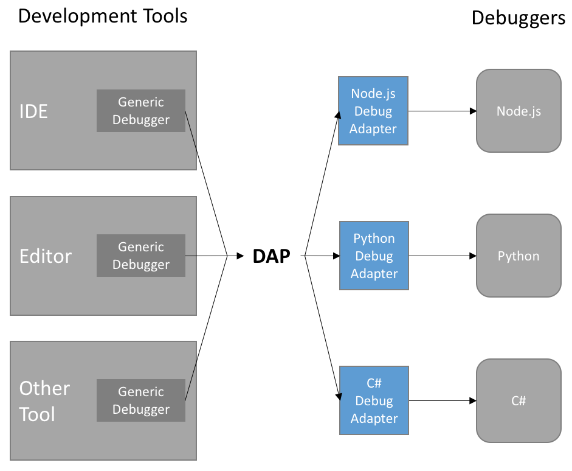

# Debug Adapter Protocol

The Debug Adapter Protocol (DAP) is an open protocol created by Microsoft to give vscode (and other editors) a common interface to interact with [all language debuggers that support the protocol](https://microsoft.github.io/debug-adapter-protocol/implementors/adapters/).



This page is meant to be a quickstart to the DAP as it is used in Pedagogical. Please see the [protocol website](https://microsoft.github.io/debug-adapter-protocol/) for more detailed info.

## Overview

The debug adapter acts as a proxy/interface into the debugger. Vscode communicates with the debug adapter through JSON messages. These messages include requests (vscode sends a command to the debug adapter), responses (the debug adapter responds to a command), and events (the debug adapter tells vscode that something happened, e.g. a breakpoint was hit).

Pedagogical can spy on an active debug session (using a [DebugAdapterTracker](https://code.visualstudio.com/api/references/vscode-api#DebugAdapterTracker)) and track events or send requests. This effectively gives us full control of a debug session as it's happening.

The information Pedagogical can get from a debug session is basically the same as the information you see in a debugger in vscode.

## Accessing the Debug State

You can access the debug state when the debugger is [`stopped`](https://microsoft.github.io/debug-adapter-protocol/specification#Events_Stopped) (hit a breakpoint, exception, etc.). The state is a nested structure:

```text
Threads
  StackTrace
    Scopes
      Variables
        ...
          Variables
```

Each object has its own request, so the process of getting a full debug state is as follows:

1. Send a `threads` request. Each `Thread` has a name and an id.

2. For each thread id, send a `stackTrace` request. Each `StackFrame` has a name, id, and other information about where the frame is (source file, line/column, etc.).

3. For each frame id, send a `scopes` request. Each `Scope` has a name, `variablesReference`, and other information (source and line/column, whether it will be expensive to fetch, etc.).

4. For each `variablesReference` number, send a `variables` request. Each `Variable` has a name, value, another `variablesReference` number, and other information. If `variablesReference` > 0, then there are child variables that can be fetched.

5. Continue fetching variables with each `variablesReference` number until you have all the information you need. This is usually done lazily (e.g. when a user expands one of the variable items in the debug panel). Also note that some items share the same reference number, in which case you should use the cached result instead of fetching it again.

## Limited Lifetime of `variablesReference`

Threads and stack frames have an `id` number, while scopes and variables have a `variablesReference` number. This are _not_ the same thing. Although the `id` numbers will stay the same throughout the entire debug session, **the lifetime of each `variablesReference` number is limitted to the current suspended state**. This means, when the debugger is no longer paused and code execution continues, those reference numbers become invalid and should not be used. The next time the debugger stops, those reference numbers may not point to the same object.

In Pedagogical, each node has its own id so we can update its values instead of creating a new node every time we fetch something. `variablesReference` should not be treated as a constant id for that object; you'll have to figure out another value to use. Most debuggers should have some alternate id you can use:

- For C/C++, you can use the variable's memory address.

- The Java debugger gives you a unique number in the `value` of a variable if it references an object. For example, a value of `String@8` means the variable reference a `String` object with a unique identifier of `8`.

- Python actually does seem to use constant reference numbers for variables (although this is undocumented and probably shouldn't be treated as an intended/stable feature).

## Differences in DAP implementations

The DAP makes it look like, whichever debugger we're using, we can follow the same process to fetch the debug state. Unfortunately, it's not quite as simple as that. Some (all?) debuggers have different features or limitations that change how they implement the DAP. Here are some examples:

- Debuggers can support optional [Capabilities](https://microsoft.github.io/debug-adapter-protocol/specification#Types_Capabilities), such as setting variables, reading memory, paginating requests, stepping backwards, and several others.

- We sometimes want to ignore information given by the debugger. In Python, we ignore the `Globals` scope (it's the same as the `Local` scope in the root stack frame) and the `special variables` variable (it contains a bunch of internal variables, which are deeply nested and effectively go on forever).

- As explained above, some debuggers treat `variablesReference` differently than others. In Python, two variables will share the same reference number if they point to the same object. In Java, all reference numbers are unique; instead, a number in the `value` of a variable is used to determine if two variables share the same reference.

## Specification

These are the DAP message types that are most useful to Pedagogical. For all messages, read the [full specification](https://microsoft.github.io/debug-adapter-protocol/specification).

- Events
  - [`stopped`](https://microsoft.github.io/debug-adapter-protocol/specification#Events_Stopped) - Indicates that the execution of the debuggee has stopped due to some condition.
- Requests
  - [`threads`](https://microsoft.github.io/debug-adapter-protocol/specification#Requests_Threads) - Returns a list of all threads in a debug session.
  - [`stackTrace`](https://microsoft.github.io/debug-adapter-protocol/specification#Requests_StackTrace) - Returns a stacktrace (list of stackframes) for a given thread id.
  - [`scopes`](https://microsoft.github.io/debug-adapter-protocol/specification#Requests_Scopes) - Returns a list of variable scopes for a given stack frame id.
  - [`variables`](https://microsoft.github.io/debug-adapter-protocol/specification#Requests_Variables) - Returns all child variables for the given variable reference.
